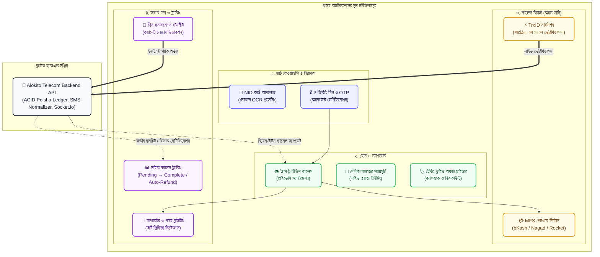
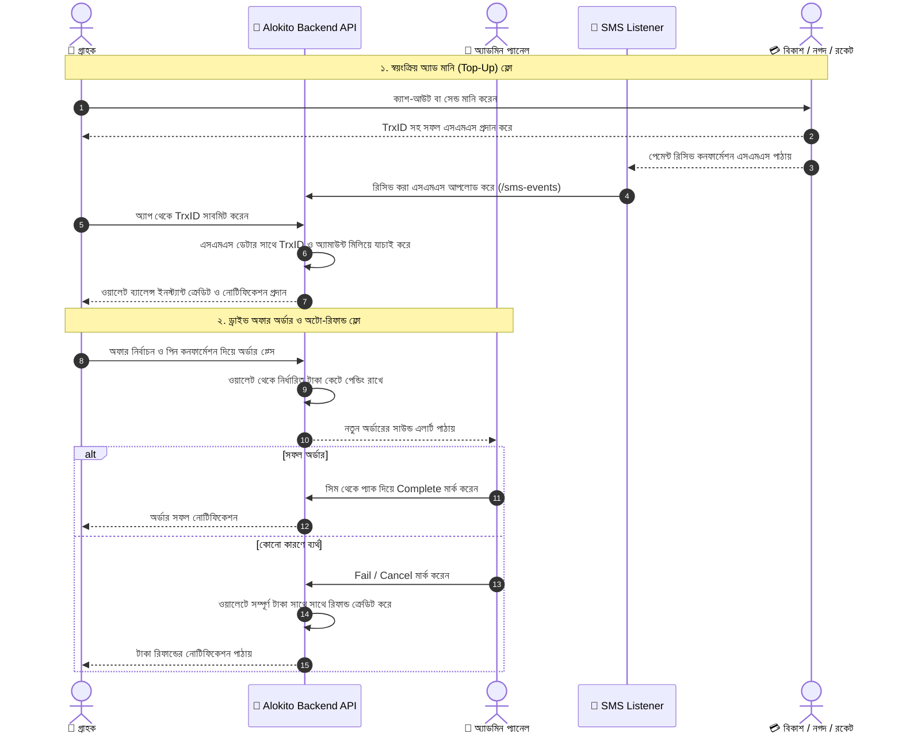

# 📱 Alokito Telecom — Customer Mobile App (আলোকিত টেলিকম গ্রাহক অ্যাপ)

[](https://flutter.dev/)
[](https://dart.dev/)
[]()
[]()
[]()

একটি প্রিমিয়াম, দ্রুতগতির এবং আধুনিক মোবাইল অ্যাপ্লিকেশন যা বাংলাদেশের গ্রাহক ও রিটেইলারদের জন্য সেরা মোবাইল ড্রাইভ অফার, ইন্টারনেট/মিনিট প্যাক ক্রয় এবং স্বয়ংক্রিয় ওয়ালেট টপ-আপ সেবা প্রদান করে।

A state-of-the-art mobile and web application built with **Flutter** for browsing telecom drive offers, instant mobile recharges, automated wallet top-ups via MFS (bKash, Nagad, Rocket, Upay), and order tracking across Bangladesh.

---

## 🌟 মূল ফিচারসমূহ (Key Features)

### ১. স্মার্ট রেজিস্ট্রেশন ও সিকিউরিটি (Smart KYC & Security)
* 🪪 **NID কার্ড ভেরিফিকেশন (KYC):** ক্যামেরা বা গ্যালারি থেকে জাতীয় পরিচয়পত্রের ফ্রন্ট ও ব্যাক সাইডের ছবি আপলোড। ব্যাকএন্ডে লোকাল Tesseract OCR এর মাধ্যমে স্বয়ংক্রিয় তথ্য যাচাই।
* 🔐 **৪-ডিজিট ট্রানজেকশন পিন:** প্রতিটি লগইন ও প্যাক পারচেজের জন্য সুরক্ষিত পিন যাচাইকরণ।
* 📩 **ইমেইল / এসএমএস ওটিপি:** রেজিস্ট্রেশন ও নতুন ডিভাইস লগইনের সময় দ্বি-স্তরীয় নিরাপত্তা (2FA)।
* 🔄 **ফরগট পিন রিকভারি:** ওটিপি ভেরিফিকেশনের মাধ্যমে তাৎক্ষণিক পিন রিসেট করার সহজ উপায়।
* 🛡️ **ট্রাস্টেড ডিভাইস প্রোটেকশন:** অচেনা কোনো নতুন ডিভাইস থেকে লগইন করলে স্বয়ংক্রিয়ভাবে ওটিপি ভেরিফিকেশন বাধ্যতামূলক।

### ২. হোম ও ব্যালেন্স ম্যানেজমেন্ট (Home & Dynamic Dashboard)
* 👁️ **ট্যাপ-টু-রিভিল ব্যালেন্স:** গোপনীয়তার জন্য ব্যালেন্স ডিফল্টভাবে হাইড থাকে; ট্যাপ করলে আকর্ষণীয় অ্যানিমেশনের মাধ্যমে ওয়ালেট ব্যালেন্স দৃশ্যমান হয়।
* 🕌 **দৈনিক নামাজের সময়সূচী (Prayer Times Card):** বাংলাদেশের সময় অনুযায়ী ফজর, যোহর, আসর, মাগরিব ও এশার রিয়েল-টাইম সময়সূচী ডিসপ্লে।
* ⚡ **কুইক অ্যাকশন গ্রিড:** ড্রাইভ অফার, রেগুলার অফার, অ্যাড মানি (ব্যালেন্স যোগ) এবং হিস্ট্রি দ্রুত ব্রাউজিং।
* 🏷️ **ট্রেন্ডিং অফার ব্যানার:** সর্বোচ্চ ক্যাশব্যাক ও ডিসকাউন্টের অফারগুলোর আকর্ষণীয় স্লাইডার।

### ৩. ড্রাইভ ও রেগুলার অফার ব্রাউজিং (Drive & Regular Packs Engine)
* 📶 **সকল প্রধান অপারেটর সাপোর্ট:** গ্রামীণফোন (GP), রবি (Robi), বাংলালিংক (Banglalink), এয়ারটেল (Airtel), টেলিটক (Teletalk)।
* 📂 **ক্যাটাগরি ফিল্টারিং:** All, Internet, Minutes, Combo এবং Special Drive Offers।
* 🔍 **স্মার্ট সার্চ ও ফিল্টার:** ডাটার পরিমাণ (GB), ভ্যালিডিটি (দিন) বা টাকার অঙ্ক অনুযায়ী তাৎক্ষণিক ফিল্টারিং।
* 🎯 **স্মার্ট নম্বর প্রিফিক্স ডিটেকশন:** প্রাপকের মোবাইল নাম্বার টাইপ করার সাথে সাথে অপারেটরের সাথে স্বয়ংক্রিয় মিল যাচাই (যেমন: `017`/`013` → GP, `018` → Robi, `019`/`014` → BL, `016` → Airtel, `015` → Teletalk)।
* 🔒 **পিন কনফার্মেশন বটমশীট:** অসাবধানতাবশত ভুল অর্ডার এড়াতে অর্ডার প্লেসমেন্টের আগে পিন দিয়ে কনফার্ম করার সুবিধা।

### ৪. স্বয়ংক্রিয় অ্যাড মানি (Automated Add Money / Top-Up)
* 💳 **মাল্টি-গেটওয়ে পেমেন্ট:** বিকাশ (bKash), নগদ (Nagad), রকেট (Rocket), উপায় (Upay)।
* 📋 **সহজ কপি ও নির্দেশনা:** লিসেনার পার্সোনাল/মার্চেন্ট নম্বর এক ট্যাপে কপি ও ক্যাশ-আউট/সেন্ড মানি করার পূর্ণাঙ্গ বাংলা গাইডলাইন।
* ⚡ **লাইভ TrxID ভেরিফিকেশন:** পেমেন্ট করার পর গ্রাহক TrxID সাবমিট করলেই ব্যাকএন্ড এসএমএস লিসেনারের তথ্যের সাথে স্বয়ংক্রিয়ভাবে মিলিয়ে চোখের পলকে ওয়ালেটে ব্যালেন্স যোগ করে দেয়। কোনো অ্যাডমিন কনফার্মেশনের জন্য অপেক্ষা করতে হয় না।

### ৫. অর্ডার ও ওয়ালেট লেজার হিস্ট্রি (Live Orders & Ledger History)
* 📊 **লাইভ অর্ডার ট্র্যাকিং:** `পেন্ডিং (Pending)` → `প্রসেসিং (Processing)` → `সফল (Completed)` / `ব্যর্থ (Failed)`।
* 💰 **অটো-রিফান্ড সুবিধা:** অ্যাডমিন কোনো কারণে অর্ডার ফেইল বা বাতিল করলে ব্যাকএন্ডের ACID লেনদেনের মাধ্যমে সাথে সাথে গ্রাহকের ওয়ালেটে টাকা রিফান্ড হয়ে যায়।
* 📒 **ডাবল-এন্ট্রি ওয়ালেট স্টেটমেন্ট:** রিচার্জ, অফার পারচেজ, রিফান্ডের প্রতিটি ট্রানজেকশনের পূর্বে ও পরের ব্যালেন্সের নিখুঁত হিসাব।
* 🔔 **ইন-অ্যাপ নোটিফিকেশন সেন্টার:** ওয়ালেট ক্রেডিট এবং অফার এক্টিভেশনের সাথে সাথে পুশ অ্যালার্ট।

---

## 🏗️ আর্কিটেকচার ও ডেটা ফ্লো (System Architecture & Workflows)

### ক. গ্রাহক অ্যাপ্লিকেশনের মডিউলার আর্কিটেকচার (Module Flowchart)



### খ. অটো-টপআপ ও ড্রাইভ অফার লাইফসাইকেল (Sequence Flow)



---

## 🛠️ টেকনোলজি স্ট্যাক (Technology Stack)

| উপাদান | প্রযুক্তি |
| :--- | :--- |
| **ফ্রেমওয়ার্ক** | **Flutter 3.x** & **Dart 3.x** (অ্যান্ড্রয়েড, আইওএস ও ওয়েব সাপোর্ট) |
| **স্টেট ম্যানেজমেন্ট** | **Provider (`^6.1.2`)** — দ্রুত ও লাইটওয়েট স্টেট সিনক্রোনাইজেশন |
| **ডিজাইন সিস্টেম** | **Material 3** — আধুনিক এমারেল্ড ও ফরেস্ট গ্রিন কালার প্যালেট |
| **লোকাল স্টোরেজ** | **SharedPreferences (`^2.2.0`)** — এনক্রিপ্টেড সেশন ও টোকেন স্টোরেজ |
| **অডিও ইঞ্জিন** | **Audioplayers (`^6.1.0`)** — অর্ডার ও ইন্টারঅ্যাকশন সাউন্ড ইফেক্ট |
| **টাইপোগ্রাফি** | **Google Fonts (`^6.2.0`)** — *Hind Siliguri* (বাংলা) এবং *Inter* (সংখ্যা/ইংরেজি) |
| **ছবি প্রসেসিং** | **Image Picker (`^1.2.3`)** & **Http Parser** — NID কার্ড ও প্রোফাইল ছবি আপলোড |
| **মুদ্রা ও তারিখ** | **Intl (`^0.19.0`)** — লোকাল বাংলাদেশি টাকা (৳) এবং বাংলা ফরম্যাটিং |

---

## 📁 ডিরেক্টরি স্ট্রাকচার (Folder Layout)

```
drive-offer-customer-app/
├── assets/
│   ├── operators/           # GP, Robi, Banglalink, Airtel, Teletalk লোগো
│   └── payments/            # bKash, Nagad, Rocket, Upay ব্যানার ও আইকন
├── lib/
│   ├── core/                # কোর সার্ভিস ও কমন উইজেট
│   │   ├── api_service.dart            # সেন্ট্রালাইজড HTTP ক্লায়েন্ট ও এরর হ্যান্ডলিং
│   │   ├── app_state.dart              # গ্লোবাল প্রোভাইডার স্টেট
│   │   ├── auth_storage.dart           # টোকেন ও সেশন স্টোরেজ
│   │   ├── constants.dart              # অ্যাপের থিম কালার, URL ও কীসমূহ
│   │   ├── sound_service.dart          # সাউন্ড ও হ্যাপটিক ভাইব্রেশন সার্ভিস
│   │   └── widgets/                    # পুনঃব্যবহারযোগ্য UI উইজেট
│   │       ├── balance_card.dart       # ট্যাপ-টু-রিভিল ব্যালেন্স কার্ড
│   │       ├── common_header.dart      # স্ট্যান্ডার্ড অ্যাপবার ও প্রোফাইল হেডার
│   │       ├── offer_card.dart         # অফার প্রদর্শন কার্ড
│   │       ├── operator_badge.dart     # টেলিকম অপারেটর ব্যাজ
│   │       └── prayer_times_card.dart  # প্রতিদিনের নামাজের সময়সূচী কার্ড
│   ├── features/            # ফিচার ভিত্তিক স্ক্রিনসমূহ
│   │   ├── auth/                       # লগইন, রেজিস্ট্রেশন, NID আপলোড, OTP, পিন রিসেট
│   │   ├── customer_main.dart          # বটম নেভিগেশন সম্বলিত রুট স্কাফোল্ড
│   │   ├── home/                       # হোম স্ক্রিন, ব্যানার, কুইক অ্যাকশন
│   │   ├── notifications/              # ইন-অ্যাপ নোটিফিকেশন সেন্টার
│   │   ├── offers/                     # ড্রাইভ ও রেগুলার অফার ব্রাউজিং ও ক্রয়
│   │   ├── orders/                     # অর্ডারের লাইভ ট্র্যাকিং ও বিস্তারিত হিস্ট্রি
│   │   ├── profile/                    # গ্রাহক প্রোফাইল, NID স্ট্যাটাস ও পিন পরিবর্তন
│   │   └── wallet/                     # অ্যাড মানি গেটওয়ে ও ওয়ালেট লেজার স্টেটমেন্ট
│   └── main.dart            # অ্যাপ এন্ট্রি পয়েন্ট
├── pubspec.yaml             # ডিপেন্ডেন্সি ও এসেট কনফিগারেশন
└── test/                    # ইউনিট ও উইজেট টেস্ট
```

---

## ⚙️ কনফিগারেশন ও সার্ভার কানেক্টিভিটি

সার্ভারের বেস URL কনফিগার করা আছে `lib/core/constants.dart` ফাইলে:

```dart
class AppDefaults {
  // লাইভ প্রোডাকশন ব্যাকএন্ড (Cloud Render)
  static const String defaultProdUrl = 'https://alokito-telecom-backend-1.onrender.com/api/v1';

  // লোকাল ডেভেলপমেন্ট
  static const String defaultLocalUrl = 'http://localhost:4000/api/v1';

  // অ্যান্ড্রয়েড ইমুলেটর
  static const String defaultEmulatorUrl = 'http://10.0.2.2:4000/api/v1';
}
```

---

## 🚀 সেটআপ ও রান করার নিয়ম (Getting Started)

### প্রয়োজনীয় টুলস
* Flutter SDK (3.11+ / Dart 3.x)
* Android Studio অথবা VS Code
* সংযুক্ত অ্যান্ড্রয়েড ফোন অথবা ক্রোম ব্রাউজার (ওয়েব প্রিভিউয়ের জন্য)

### ১. ডিপেন্ডেন্সি ইন্সটল
```bash
cd drive-offer-customer-app
flutter pub get
```

### ২. ডিবাগ মোডে চালানো
```bash
# অ্যান্ড্রয়েড বা আইওএস ডিভাইসে রান করতে:
flutter run

# ক্রোম ব্রাউজারে রান করতে:
flutter run -d chrome
```

### ৩. কোড ভ্যালিডেশন ও টেস্ট
```bash
flutter analyze
flutter test
```

---

## 📦 প্রোডাকশন রিলিজ বিল্ড (Build APK & Web)

### অ্যান্ড্রয়েড রিলিজ APK তৈরি
```bash
# সাধারণ রিলিজ APK:
flutter build apk --release

# সাইজ ছোট করার জন্য Split-per-ABI APK (armeabi-v7a, arm64-v8a):
flutter build apk --split-per-abi --release

# গুগল প্লে-স্টোরের জন্য App Bundle (AAB):
flutter build appbundle --release
```
*বিল্ড সম্পন্ন হওয়ার পর APK পাওয়া যাবে: `build/app/outputs/flutter-apk/app-release.apk` ফোল্ডারে।*

### ওয়েব বিল্ড (Web Release)
```bash
flutter build web --release --web-renderer canvaskit
```

---

## 🎨 কালার ও ব্র্যান্ড গাইডলাইন

* **Primary Corporate:** `#0D5E36` (ফরেস্ট এমারেল্ড গ্রিন)
* **Primary Accent:** `#15803D` (ভাইব্রেন্ট লিফ গ্রিন)
* **Background Canvas:** `#F8FAFC` (ক্লিন অফ-হোয়াইট)
* **MFS ব্র্যান্ড কালার:**
  * bKash: `#E2136E`
  * Nagad: `#F7941D`
  * Rocket: `#8C3494`
  * Upay: `#004B87`

---

## 🛡️ নিরাপত্তা ও গোপনীয়তা

1. **ওয়ালেট লেজার ইন্টিগ্রিটি:** কোনো ফ্লোটিং সংখ্যা ব্যবহার করা হয় না; প্রতিটি হিসাব ব্যাকএন্ডে পূর্ণসংখ্যার পয়সায় সংরক্ষিত।
2. **NID ডেটা প্রটেকশন:** NID কার্ডের ছবি ব্যাকএন্ড ক্লাউডিনারিতে সুরক্ষিত ও প্রাইভেট স্টোরেজে সংরক্ষিত থাকে।
3. **পিন এনক্রিপশন:** কোনো পিন সরাসরি লোকাল ডিভাইসে ক্যাশ করা হয় না; Argon2 এনক্রিপশনের মাধ্যমে ব্যাকএন্ডে যাচাই করা হয়।

---

## 📄 লাইসেন্স ও স্বত্বাধিকার

**আলোকিত টেলিকম (Alokito Telecom)** — সর্বস্বত্ব সংরক্ষিত।
অনুমতি ছাড়া এই অ্যাপ্লিকেশনের কোড কপি বা বাণিজ্যিক উদ্দেশ্যে বিতরণ সম্পূর্ণ নিষিদ্ধ।
